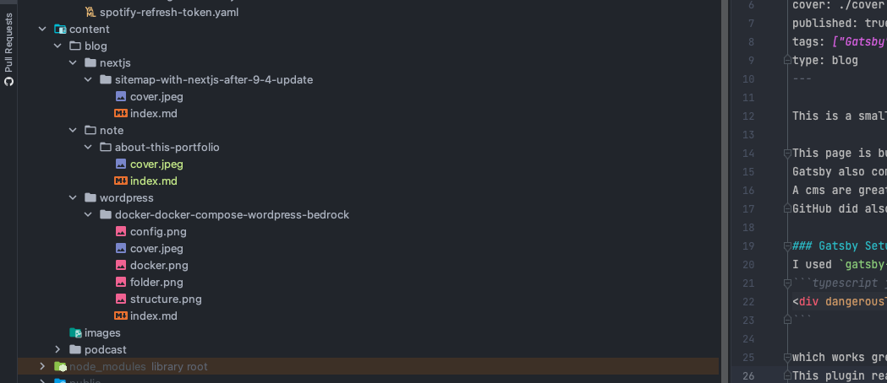

This is a small post about this portfolio and how it's build and why I chose this technology.

This page is build using Gatsby, a Static Site Generation using React. The reason why is mostly because I wanted to host this site on Cloudflare. And using a framework like [Next.JS](https://nextjs.org/) wouldn't work as Cloudflare does not support it. I did build a portfolio using Remix hosted on Cloudflare Workers, which was worked great, but I needed to develop a lot of functionality myself. Which is fun but sometimes have something finished works great aswell.
Gatsby also comes with a lot out of the box, ex plugins. These plugins are later on used to speed up a workflow. For example did I go from a hosted CMS to markdown as I thought it was unnecessarily to use a hosted CMS which could be a extra cost. Also writing markdown doesn't need much more time then writing a post in a CMS, also am I more locked in when using a CMS as I am only able to use the stuffs that the CMS offer where in markdown am I free to do whatever I want.
A cms are great if you want to simply be able to enter an interface and write whatever and have it published, it's also perfect if you don't have much experience in writing markdown and code. But for me is a simple markdown really usefull.
GitHub did also release an "online" instance of VS code which I can use to write markdown and changes and deploy it to the site.

### Gatsby Setup
I used `gatsby-transformer-remark` to find my markdown, read the path to the markdown, parse them and generate data to Gatsbys GraphQL. I installed plugins to parse my images and texts which converts the markdown into HTML and input the html via a simpel 
```typescript jsx
<div dangerouslySetInnerHTML={{__html: post.html}} />
```

which works great. All images are optimized and lazy loaded, all my code blocks are turned into html via `<pre>` tag which I with prisma use to style the code blocks.
This plugin reads the path to `index.md` file which I later on use in the browser as the path to the post. Meaning that I can use how many subdirectories as I want.



To get my Spotify songs did I use `gatsby-source-spotify`. A really simple plugin where I parse Refresh token, client id and secret which the plugin use to find data on build time. The only problem I found is that the refresh token expires and I need a good way to refresh it. I write more about in on [Spotify](#spotify). This plugin also generates Gatsby images.
### Cloudflare
I hosted my site on Cloudflare. Cloudflare is great for this purpose and works really fast. For what I know does Cloudflare have the most edge locations which makes the load of the page the fastest compared to others. 
Not only do they have the most datacenters locations, they also give me the most of my free tier. Normally would other CDNs provide my with a quota which works for my purposes and is great, but they have a limit. Cloudflare offers me Unlimited sites, requests and bandwith for 0 cost.

The only bad thing I've found is that the build time is much longer then others providers. Gatsby Cloud is really fast compared to Cloudflare. But for my case does this build time work just fine.

I wanted to update my Spotify information on the page automatically, so I developed a Github Action which every third hour send a simple POST request to Cloudflare to rebuild my page and deploy it using the code below:
```yaml
name: Send webook request to cloudflare to rebuild page

on:
  workflow_dispatch:
  schedule:
    - cron: "0 */3 * * *"

jobs:
  cron-send-webhook-request:
    runs-on: ubuntu-latest
    steps:
      - name: Send Webhook request
        uses: fjogeleit/http-request-action@master
        with:
          url: ${{ secrets.CLOUDFLARE_WEBHOOK }}
          method: 'POST'


```
This Action also supports me triggering a new rebuild job via Github actions.
As my [repository](https://github.com/emilpriver/gatsby-markdown-portfolio) for this page is public did I store the Webhook URL in Github Secrets. All jobs made via this cron do you find here: https://github.com/emilpriver/gatsby-markdown-portfolio/actions/workflows/actions-cron.yaml

### Spotify
I did before build a [worker on Cloudflare](https://github.com/emilpriver/Cloudflare-Workers-Spotify-most-played-song) used to fetch my top played songs and artists, but also what im listening as we speak. 
I wanted to integrate this worker on my page for fun, so I build a simple fetch function together with SWR to fetch and display what I am listening to at the moment using this code:
```typescript jsx
const fetcher = () => fetch('https://spotify-list-most-played-songs.emilpriver.workers.dev/playing')
    .then((r) => r.json() as Promise<SpotifyCurrentPlayingType>)

const SpotifyCurrentPlaying: React.FC = () => {
  const {data, error, isValidating} = useSwr('/api/spotify/playing', fetcher)

  return (
      <div className="col-span-1 p-6 bg-white rounded-3xl min-h-64 flex justify-between flex-col">
        <div className="w-full flex items-center mb-2">
          <SpotifyIcon className="h-12 w-12 mr-4 fill-spotify"/>
        </div>
        <div>
          {data && !error ? (
              <>
                <span className="text-spotify mb-4"> Now Playing </span>
                <a href={data?.item.external_urls.spotify} target="_blank" rel="noopener noreferrer nofollow">
                  <h3 className="text-xl">{data?.item.name}</h3>
                  <span>{data?.item.artists.map((el, index) => `${el.name}${(index + 1) !== data.item.artists?.length ? ', ': ''}`)}</span>
                </a>
              </>
          ) :  (
              <>
                {!isValidating ? (
                    <span className="text-red-600 mb-4"> Not currently playing</span>
                ) : <Skeleton count={3} />}
              </>
          )}
        </div>
      </div>
  )
}
```

To get what my most played Albums are did I use a simple Gatsby plugin which on build time fetch data from Spotify via the really simple setup here:
```javascript
{
      resolve: `gatsby-source-spotify`,
      options: {
        clientId: process.env.SPOTIFY_CLIENT_ID,
        clientSecret: process.env.SPOTIFY_CLIENT_SECRET,
        refreshToken: process.env.SPOTIFY_CLIENT_REFRESH,
        timeRanges: ['medium_term']
      },
},
```

As Spotify have an end time for its refresh token did I need to build something that refresh the tokens every 6 hour. So I used the same idea for Cloudflare Workers to refresh the Spotify token every 6 hour. But Spotify needed POST data which was used to verify the requst which ended up in this code:
```yaml
name: Refresh Spotify long lived-token

on:
  workflow_dispatch:
  schedule:
    - cron: "0 */6 * * *"

jobs:
  cron-send-spotify-webhook-request:
    runs-on: ubuntu-latest
    steps:
      - name: Send refresh spotify token request
        uses: fjogeleit/http-request-action@master
        with:
          url: https://accounts.spotify.com/api/token
          method: 'POST'
          customHeaders: '{"Content-Type":"application/x-www-form-urlencoded","Authorization":"Basic ${{ secrets.SPOTIFY_BASIC_TOKEN }}"}'
          data: "grant_type=refresh_token&refresh_token=${{ secrets.SPOTIFY_REFRESH_TOKEN }}"
```

This way is Spotify always providing me data which I use on the website.

#### Spotify on the page
I used this code to fetch the artists and then display them:
````typescript
const data = useStaticQuery<SpotifyQuery>(graphql`
  query MostPlayedSpotifyArtists {
    spotify: allSpotifyTopArtist(filter: {time_range: {eq: "medium_term"}}, limit: 8) {
        nodes {
            uri
            time_range
            external_urls {
                spotify
            }
            image {
                localFile {
                    id
                    childImageSharp {
                        gatsbyImageData(
                            width: 200
                            height: 200
                            webpOptions: {quality: 70}
                            formats: [AUTO, WEBP, AVIF]
                            placeholder: BLURRED
                            quality: 70
                        )
                    }
                }
            }
            name
            popularity
        }
    }
}
`)

````

### Instagram
I wanted to develop something like VSCO where I could just upload images of stuffs I do, but VSCO don't have a public API or does not allow scraping which needs me to use something else. 
A possible solution could be an Unsplash collection, but Unsplash have a standard on images which makes harder to upload images, but also takes time as a team is reviewing the image. 
I wanted to be more free, which made me think of Instagram. Instagram allowes me to upload whatever I want, I can lock the account and still get the images using API. 
Which is perfect but the only problem is the same problem as all other platforms, the token. It expires. But as I've already developed Github Actions to refresh token and to rebuild page did I think of a way to the exact same thing.
Which resulted in this

````yaml
name: Refresh instagram long lived-token

on:
  workflow_dispatch:
  schedule:
    - cron: "0 0 * * MON"

jobs:
  cron-send-instagram-webhook-request:
    runs-on: ubuntu-latest
    steps:
      - name: Send refresh instagram token request
        uses: fjogeleit/http-request-action@master
        with:
          url: ${{ secrets.INSTAGRAM_REFRESH_TOKEN_URL }}
          method: 'GET'
````
A simple Action send a GET request to Instagram to the refresh the token, where the token is stored in Github Secrets. But Instagram didn't need to refresh every day as Spotify does so I changed the CRON to run every monday.

#### Instagram on the page

In order to show the images I uploaded on Instagram on the page did I use Gatsby plugin which fix everything for me, fetches posts and generates Gatsby image for all images. 
With this simple code:
```javascript
{
      resolve: `gatsby-source-instagram-all`,
      options: {
        access_token: process.env.INSTAGRAM_TOKEN,
      },
    },
```
Was I able to fetch the posts using this GrahpQL 
````typescript
const data = useStaticQuery<InstagramQuery>(graphql`
    query InstagramImages {
      instagram: allInstagramContent(
        limit: 10000
        sort: {fields: timestamp, order: DESC}
      ) {
        nodes {
          media_url
          username
          media_type
          media_id
          localFile {
            childImageSharp {
              gatsbyImageData(layout: CONSTRAINED, placeholder: BLURRED, quality: 90)
            }
          }
        }
      }
    }
`)
````

## Why I didn't use Next.js
Next is great, It's normally my go to when building React projects as of the dynamic SSG, but this page is hosed on Cloudflare Pages where the only way to use Next on Cloudflare is to use Next Export where it works the exact same way as Gatsby.
Next would also force me to write more code and as I wanted to get up and running really fast was Gatsby a faster option as of the plugins you are able to use. 
This page was build in less the 2 evenings. Maybe 6-8 hours of coding. And as I would need more code in Next would it probably need more time. But for bigger projects, for ex an e-commerce site would I definitely use Next.js. 


## The end. 
Hope you found this post fun. There is no right and wrong of your solution, Using Gatsby, Next, remix and so on is up to you. 
> Whatever float your boat

Reach out to my [Twitter](https://twitter.com/emil_priver) if anything
